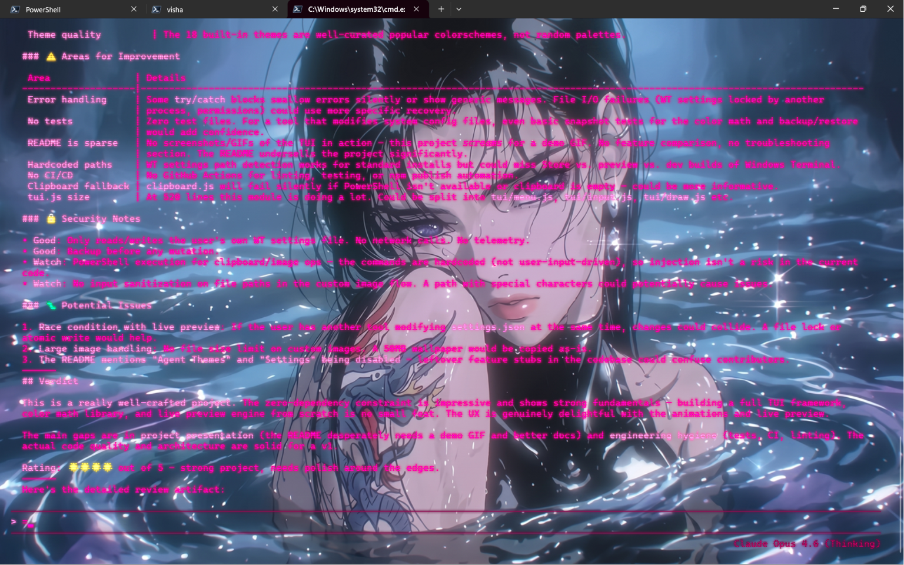
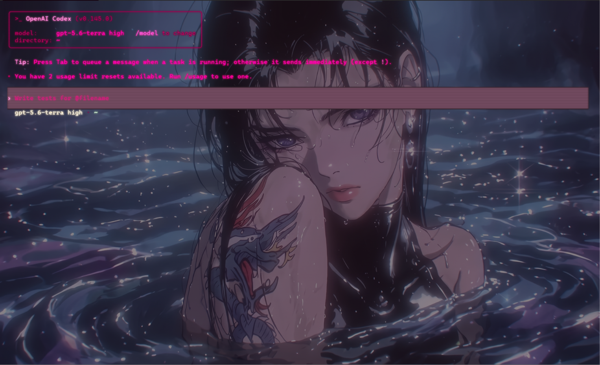

<p align="center">
  <h1 align="center">>_< TERMCUTE</h1>
  <p align="center">
    <b>A heavily animated CLI that makes your terminal cute.</b>
    <br/>
    Themes Windows Terminal with live preview, safe backups, and one-key restore.
  </p>
</p>

<p align="center">
  <a href="https://www.npmjs.com/package/termcute"></a>
  <a href="https://www.npmjs.com/package/termcute"></a>
  
  
  <a href="LICENSE"></a>
</p>

---

<p align="center">
  
</p>

<p align="center">
  
</p>

<p align="center">
  
</p>

---

## ✨ Highlights

- 🎨 **18 built-in themes** — Catppuccin, Dracula, Nord, Gruvbox, Tokyo Night, Rosé Pine, and more
- 🖼️ **Custom wallpapers** — from file, clipboard, or built-in collection
- 🔴🟢🔵 **Custom palettes** — generate a full 16-color terminal scheme from a single accent color
- 👀 **Live preview** — see every change in real-time before committing
- 💾 **Safe backups** — automatic byte-identical backup on first run, one-key restore
- 🎬 **Heavily animated** — typewriter effects, transitions, and a TUI that sparks joy
- 📦 **Zero dependencies** — pure Node.js, no build step

## Install

```bash
npm install -g termcute
termcute
```

> Requires **Node.js 18+** and **Windows Terminal**.

## Features

### 🎨 Browse Themes

Preview built-in themes live and apply one permanently. Arrow through 18 curated
colorschemes while watching your terminal transform in real-time.

### 🔴🟢🔵 Custom Theme

Pick an accent color with an interactive hue slider. TermCute generates a
cohesive 16-color palette, then lets you tweak font size, opacity, and padding —
all with live preview.

### 🖼️ Custom Image

Choose a background image from three sources:

- **Local file path** — point to any image on disk
- **Clipboard paste** — grab an image straight from your clipboard
- **Built-in wallpapers** — pick from the bundled collection

TermCute normalizes the image and lets you dial in the opacity before applying.

### ⏪ Restore Defaults

Restore the byte-identical Windows Terminal settings saved before TermCute first
made a change. One key, zero worries.

## CLI

```bash
termcute                                      # animated picker
termcute list                                 # list built-in themes
termcute apply <slug>                         # apply a theme permanently
termcute custom-image <path> [--fit smart|crop|pad]
termcute custom-image --clipboard
termcute restore                              # restore original settings
```

## Safety

- The first modification saves `settings.termcute-original.json` next to
  Windows Terminal's settings file and **never overwrites it**.
- Writes are atomic, and live preview is reverted on `Esc`, `Ctrl+C`, or a
  crash.
- No network calls. No telemetry. Your settings stay local.

## Built With

| What | How |
|------|-----|
| TUI framework | Custom — built from scratch with ANSI escape codes + `readline` |
| Color math | Custom HSL ↔ RGB ↔ Hex engine for palette generation |
| Animations | Frame-by-frame ASCII art, typewriter effects, screen wipes |
| Image handling | PowerShell/.NET interop for clipboard + format normalization |
| Dependencies | **None.** |

## Development

```bash
git clone https://github.com/vishalx0707/termcute.git
cd termcute
node bin/termcute.js
```

## License

[MIT](LICENSE)
